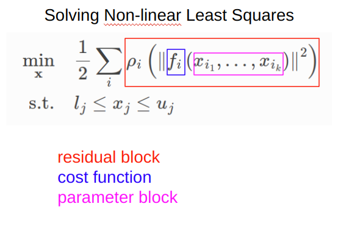
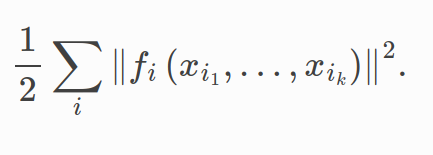

# Ceres
Ceres는 구글에서 개발한 오픈소스 C++  비선형 최적화 라이브러리로, 주로 다루는 것은 Non-linear Least Square 문제(\ref{fig:Non-linear Least Squares})이다. 이 식의 각 구성요소를 각각 residual block , Cost Function, Parameter Blocks라 부른다. $\rho_i$ 는 Loss function 이라 부르며, Scalar value function 이다.  $l_i$ 와 $u_i$ 는 parameter block $x_j$ 의 하한과 상한이다.  만약 $\rho_i(x)=x$ 이고,  $l_i = \infty$ , $u_i =\infty$ 일 경우, 이러한 문제를 unconstrained non-linear least squares problem 이라 부른다. 

    

    

Ceres 는 1. Least Square Problem 모델링과 2. 최적화 알고리즘=Solver 로 구성된다. 만약 유저가 Ceres 를 사용하기 위해서는 다음 4개의 코드를 순서대로 작성해야 한다.
1. 최적화를 위한 residual function 구성
2. Optimization problem 구성
3. 각 데이터에 맞게 residual block 추가
4. Overall Optimization

가장 간단한 예시인

